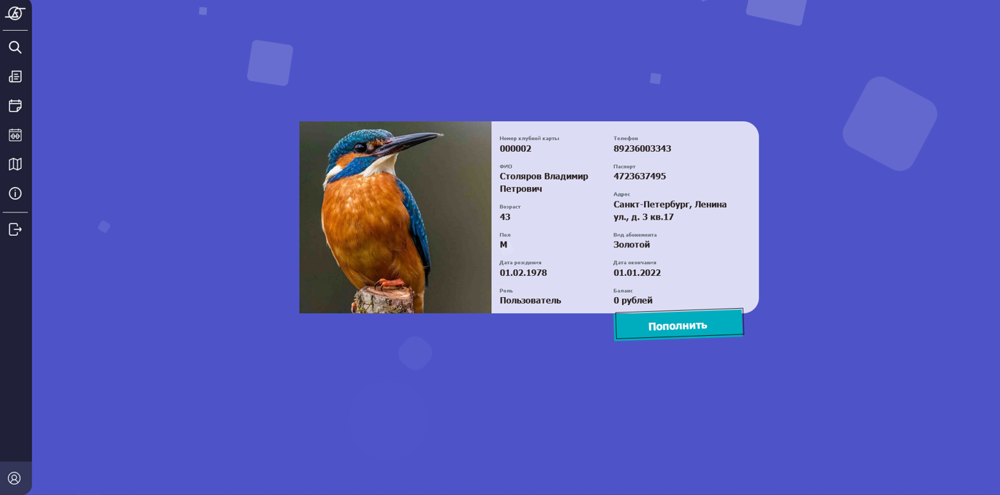
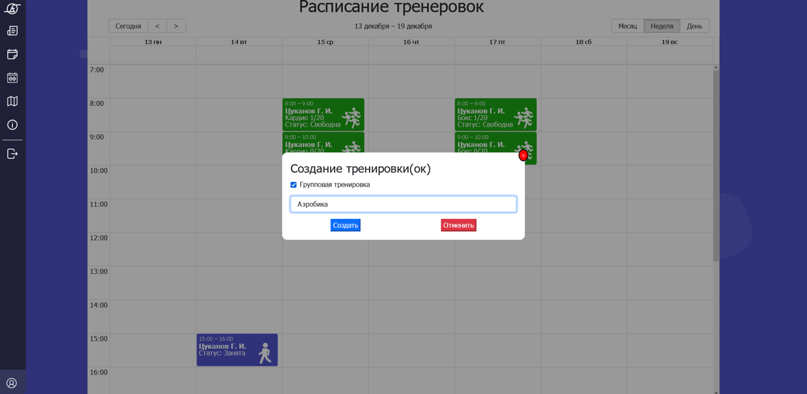
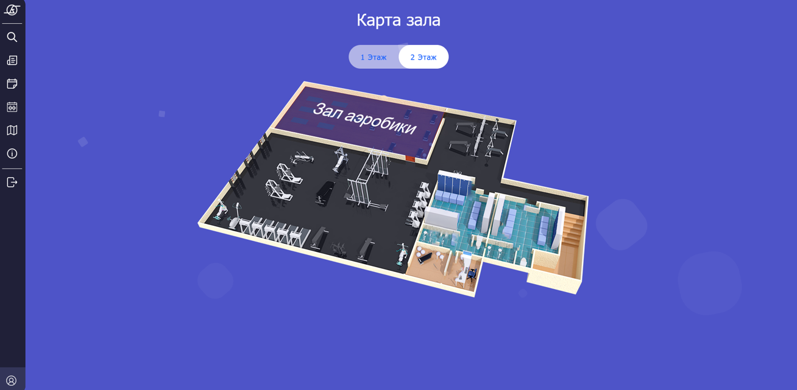
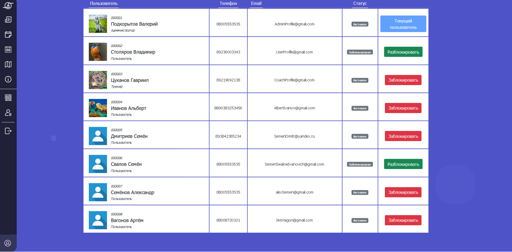

# Fit Style
## Creating a web application for a Fitness club  

## Why do we need this app?
The web application will allow you to combine many fitness-related processes in one place. It will be easier for the clients of the fitness room to navigate indoors and find the right venues/halls faster. Also, communication between coaches and clients will be in one chat. There will be no need to switch to other apps to arrange a workout. Clients will be able to watch their coaches' schedules and sign up for personal/group training sessions. Everything related to the fitness room will be in one application, which will simplify and improve interaction with the fitness room.

## Web application functionality
- Profile, which displays information about the user (Name, photo, account balance)  
- Publication of news and other company information (News feed)  
- Viewing the work schedule of employees  
- Selection of training grounds/halls  
- View an individual calendar with workouts and meetings  
- Viewing and possibility of communication (correspondence) with company employees, chat with support  
- The opportunity to find out where the sports grounds/halls are located (a fitness club map showing the numbers of all halls)  
- Viewing company information  
- Each client has a personal account, to pay for services (training), the client can top up his account with a bank card.  

## Our team

| Full name  | Roles |
| ------------- | ------------- |
| Старосельский Александр Константинович | Project Manager, Architect, Front-end |
| Жиренкин Артем Валерьевич | Front-end  |
| Чиганов Даниил Ренатович | Back-end  |
| Астахов Михаил Андреевич | Database  |
| Темников Игорь Олегович | Analyst, Tester  |

## Technology Stack
##### FrontEnd:
- HTML + CSS + JS
- Node.js (for React.js)
- React.js 
- Bootstrap 5
- Axios
##### BackEnd:
- Java
- Spring Data JPA
- Spring MVC
- PostgreSQL 

## Preview

### Authorization page

### User Profile

### Training tab

### Map

### Users tab

---

## Installation 

#### Clone
```sh
git clone https://github.com/stormpero/Fit-Style.git; cd Fit-Style; rm readme.md 
```
### FrontEnd  
----
Download Node.js: [Download](https://nodejs.org/en/ "Node.js =)")
#### Install dependencies
```sh
npm install
```
#### Start react-app
```sh
npm start
```

### BackEnd  
----
Download Postgresql: [Download](https://www.enterprisedb.com/downloads/postgres-postgresql-downloads "Postgresql =)")  
Create database with name "fit-style"

#### Start backend on windows
```sh
./mvnw.bat spring-boot:run
``` 
#### Start backend on linux
```sh
./mvnw spring-boot:run
``` 

or you can just open folder backend with IntelliJ IDEA  
Wait until the dependencies are established  

----
Servers:
```sh
[Client] Frontend: localhost:3000
[Server] Backend: localhost:8080
```
