# Database structure
## User
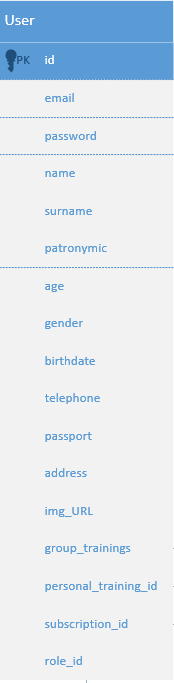

Represent user of our web application. He can have one or more roles from this list: user(by default), coach, moderator, admin.
- User can sign for trainings, add money to his balance, check news of our fitness club.
- Coach can create/delete trainings.
- Moderator can register new users/coaches, create/delete news.
- Admin is the main role. He can assign new moderators and admins.

Each user can sign for one or more personal or group trainings.

User must have subscription. It has the same id as the user himself.

## Role
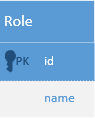

Role table. Each role has id and name. It has many to many connection between user.

## Subscription

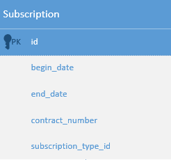

Represents user subscription info. It has one to one connection between user. Also user has the same subscription id as his own id (primary key connection).
It contains begin and end date, contract nubmer and subscription type id. It has many to one connection between subscription type table. 

## Subscription type

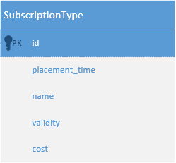

It has four fields: name, validity(in months), cost and placement_time which can be: day, evening, all day.

## Personal training

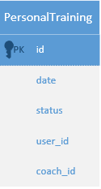

Contains info about coach who will conduct a training, user who will visit that training, date when that training would happen, and status: logged, active, ended, etc...

## Group training

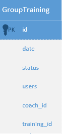

The same as personal training but many users can sign for that and also it has connection between training table.

## Training type

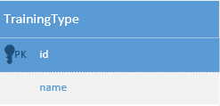

Just info about training.

## News

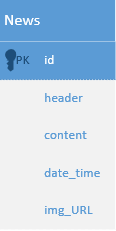

Info about news. Time when it was published. Its image URL.

## Refresh token

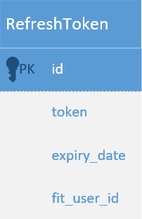

Stores refresh token of every logged user. Used to update access token.
Every user can only have one refresh token. It has expire data - date
when our refresh token will become invalid and would not refresh our
access token.

## Password recovery

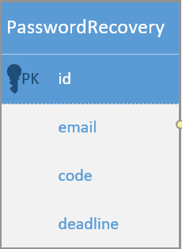

Stores verification codes for password recovery.
It also has expire date - date when our verification code 
would not recover our password

## Database
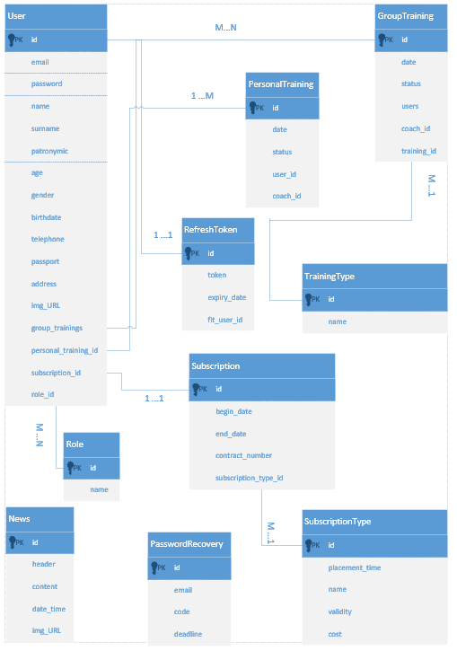